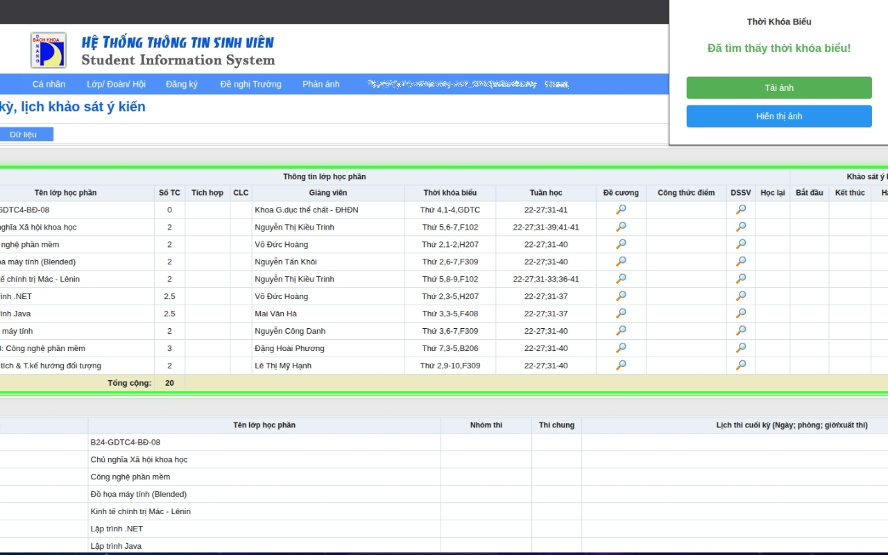
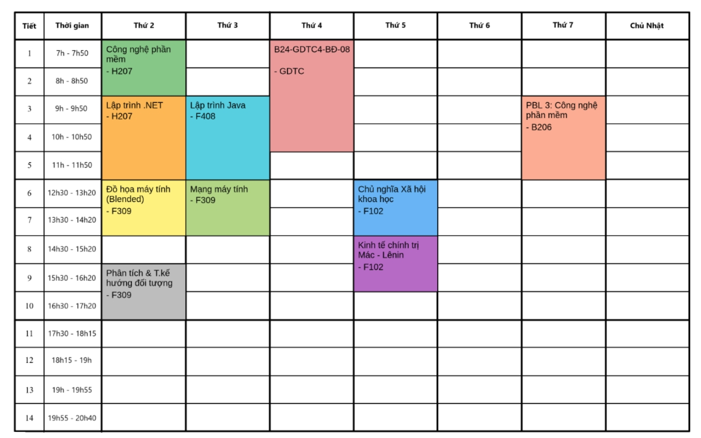

# DUT Schedule Generator

A Chrome extension for extracting table data from web pages and generating schedule images.

## Features

- 🔍 **Table Detection**: Automatically scans and identifies tables on web pages
- 🎯 **Smart Highlighting**: Visual highlighting of selected tables with smooth animations
- 📊 **Data Extraction**: Converts table data to structured JSON format
- 🖼️ **Schedule Generation**: Generates schedule images via API integration

## Cách sử dụng

1. **Cài đặt extension**:
   - Truy cập đường link sau: [DUT Schedule Generator - Chrome Web Store](https://chromewebstore.google.com/detail/dut-schedule-generator/bedfdmellajegcjgbkfdenkmpjbkalfi)
   - Hoặc Chrome Webstore, tìm kiếm: "DUT Schedule Generator"
   - Nhấn vào **Cài đặt**

2. **Sử dụng**:
   - Vào trang sinh viên/trang đăng ký tín chỉ (*.dut.udn.vn)
   - Click vào icon extension trên thanh toolbar
   - Chắc chắn rằng thời khóa biểu bạn muốn xem đang hiển thị 
   - Click "Hiển thị ảnh" để xem ngay thời khóa biểu trên trình duyệt
   - Click "Tải ảnh" để tải ảnh về máy

## Cấu trúc files

- `manifest.json`: Cấu hình extension
- `popup.html`: Giao diện popup
- `popup.js`: Logic xử lý popup
- `content.js`: Script chạy trên trang web để quét và highlight
- `content.css`: Styles cho highlight effect

## Browser Support

- Chrome (Manifest V3)
- Microsoft Edge
- Các trình duyệt Chromium khác

# Demo

